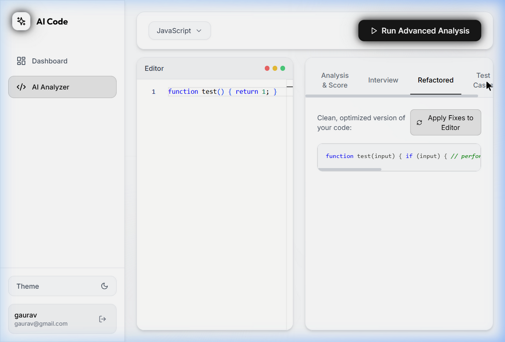

# 🚀 AI Code Analyzer

An advanced, production-grade AI-powered code analysis platform built on the **MERN Stack** (MongoDB, Express, React, Node.js). This platform acts as your personal Senior Software Engineer, offering deep code analysis, auto-refactoring, simulated technical interviews, and automated test case generation.

---

## 🌟 Key Features

* 🌗 **Dynamic Dark/Light Mode**: A sleek, persistent theme toggle offering a vibrant Vercel-style Dark Mode and a crisp, professional monochrome Light Mode.
* 🛡️ **JWT Authentication & Security**: Complete user registration and login system with secure password hashing and API rate-limiting to prevent abuse.
* 💯 **Deep Code Scoring**: Evaluates your code out of 100 based on Correctness (40), Efficiency (30), Readability (20), and Best Practices (10).
* 🐞 **Bug Highlighting**: Line-by-line breakdown of logical and syntax errors with proposed fixes.
* 🧠 **Simulated Interviewer**: The AI generates tough follow-up technical questions based specifically on the code you submitted.
* 🛠️ **Auto-Refactoring**: Returns a clean, highly optimized version of your code with an "Apply Fixes" button that injects it straight back into your editor.
* 🧪 **Test Case Generation**: Automatically generates Edge, Typical, and Corner test cases with expected outputs.
* 📊 **History Dashboard**: Automatically saves all your past analyses to your personal dashboard.

---

## 🛠️ Tech Stack

### Frontend
* **React 18** (Vite)
* **Tailwind CSS** (for dynamic styling and glassmorphism)
* **Framer Motion** (for smooth layout and entrance animations)
* **Monaco Editor** (VS Code's core editor on the web)
* **React Router Dom** (for protected SPA routing)

### Backend
* **Node.js & Express**
* **MongoDB & Mongoose**
* **JSON Web Tokens (JWT) & bcryptjs** (Auth)
* **Groq API SDK** (Utilizing the blazing-fast `llama-3.1-8b-instant` model)

---

## 🚀 Getting Started

### Prerequisites
* Node.js (v18+)
* MongoDB connection URI
* Groq API Key

### 1. Clone the repository
\`\`\`bash
git clone <your-repo-url>
cd AI_CODE_EXPLAINER/mern_code_analyzer
\`\`\`

### 2. Backend Setup
\`\`\`bash
cd backend
npm install

# Create a .env file and add your credentials:
# PORT=5000
# MONGO_URI=your_mongodb_connection_string
# JWT_SECRET=your_super_secret_key
# GROQ_API_KEY=your_groq_api_key

npm run dev
\`\`\`

### 3. Frontend Setup
Open a new terminal window:
\`\`\`bash
cd frontend
npm install
npm run dev
\`\`\`

### 4. Visit the Application
Navigate to `http://localhost:5173` in your browser. Register a new account to access the dashboard!

---

## 🔮 Future Scope

While the application is fully functional, here are some planned future enhancements:
1. **Real-time Collaboration**: Allow multiple users to connect to the same editor instance via WebSockets and run joint AI analyses.
2. **GitHub Integration**: Connect directly to your GitHub repositories to analyze whole pull requests rather than isolated snippets.
3. **Multi-File Context**: Allow users to upload multiple files or entire folder structures to give the AI context of the entire architecture.
4. **Export to PDF**: Generate a professional PDF report of the code analysis for documentation purposes.

---

## 👨‍💻 Credits

Designed and Engineered by **Gaurav Kumar Pandey**  
*Built for developers who want to write better, cleaner, and faster code.*
